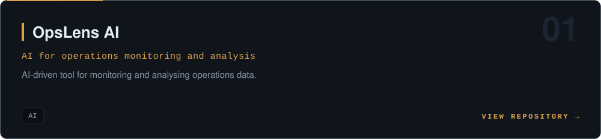
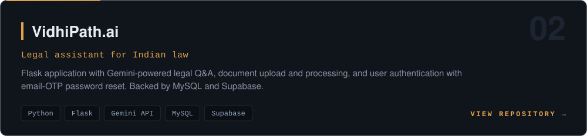
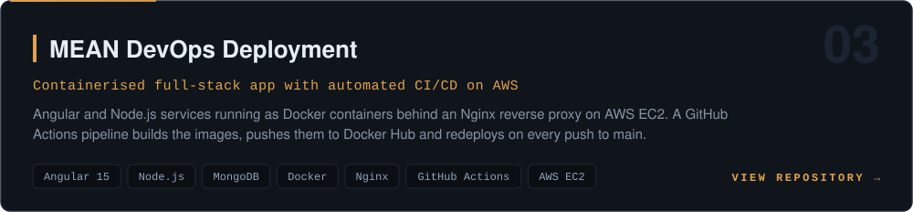
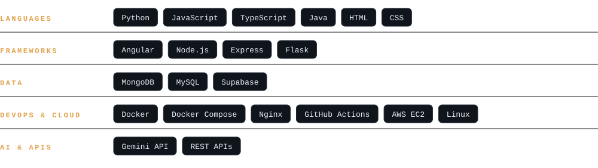

<a href="#about">ABOUT</a> &nbsp;·&nbsp; <a href="#work">WORK</a> &nbsp;·&nbsp; <a href="#stack">STACK</a> &nbsp;·&nbsp; <a href="#activity">ACTIVITY</a> &nbsp;·&nbsp; <a href="#contact">CONTACT</a>

 

Final-year **B.E. Computer Science** student at **ATME College of Engineering, Mysore**. I build full-stack and AI-backed applications, and ship them through containerised, automated deployments.

- **Focus:** full-stack development, DevOps, applied AI
- **Team:** Double.exe, competing in ideathons
- **Interest:** software that serves underserved communities
- **Program:** JPMorgan Chase Advanced Software Engineering on Forage (Java), see [forage-midas](https://github.com/Abhinandan12317/forage-midas)

 

<!-- TODO: replace the link below with the real OpsLens AI repository URL, and edit the one-line description in assets/card-opslens.svg -->

 

 

<picture>
  <source media="(prefers-color-scheme: light)" srcset="https://raw.githubusercontent.com/Abhinandan12317/Abhinandan12317/output/github-snake.svg" />
  
</picture>

 

 

  

